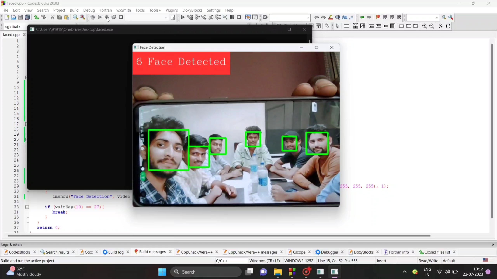

# Face Detection System Using C++

## Project Overview

This project is a Face Detection System implemented using C++. It utilizes the OpenCV library to detect faces in real-time from webcam input. This project was developed during my summer internship to gain hands-on experience with C++ and computer vision techniques.

## Features

- Real-time face detection
- Utilizes the OpenCV library
- Simple and efficient implementation
- Capable of detecting multiple faces simultaneously

## Demo Video

Watch the project demo on YouTube: [Face Detection System Using C++ | Project Demo](https://youtu.be/3WbrT96q5dU?si=ItEVphwutPfojlD3)

## Getting Started

### Prerequisites

- C++ compiler (e.g., GCC, Clang)
- OpenCV library
- Webcam (for real-time face detection)
- codeblocks software 

### Installation

1. **Clone the repository:**
   ```sh
   git clone https://github.com/Tulaseeram-panga/facedetectioncpp.git
   cd facedetection
   ```

2. **Install OpenCV:**
   Follow the installation instructions from the [OpenCV documentation](https://docs.opencv.org/master/df/d65/tutorial_table_of_content_introduction.html).

3. **Compile the project:**
   ```sh
   g++ -o FaceDetection FaceDetection.cpp `pkg-config --cflags --libs opencv4`
   ```

4. **Run the project:**
   ```sh
   ./FaceDetection
   ```

## Project Structure

- `FaceDetection.cpp` - Main source code file for the face detection system.
- `README.md` - Project documentation.

## Usage

Run the executable to start the face detection system. The program will open a window displaying the webcam feed with detected faces highlighted by rectangles.

## Example Output



## Contributing

Contributions are welcome! Please fork the repository and submit a pull request for any improvements or bug fixes.

## License

This project is licensed under the MIT License. See the [LICENSE](LICENSE) file for details.

## Contact

For any inquiries or further information, please contact me:

- GitHub: [Tulaseeram-panga](https://github.com/Tulaseeram-panga)
- LinkedIn: [tulaseerampanga](https://www.linkedin.com/in/tulaseerampanga)
- Email: [ptulaseeram656@gmail.com](mailto:ptulaseeram656@gmail.com)

## Acknowledgments

- Thanks to OpenCV for providing a powerful computer vision library.
- Special thanks to my internship mentors for their guidance and support.
